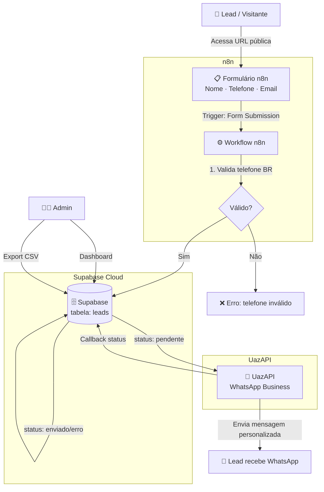
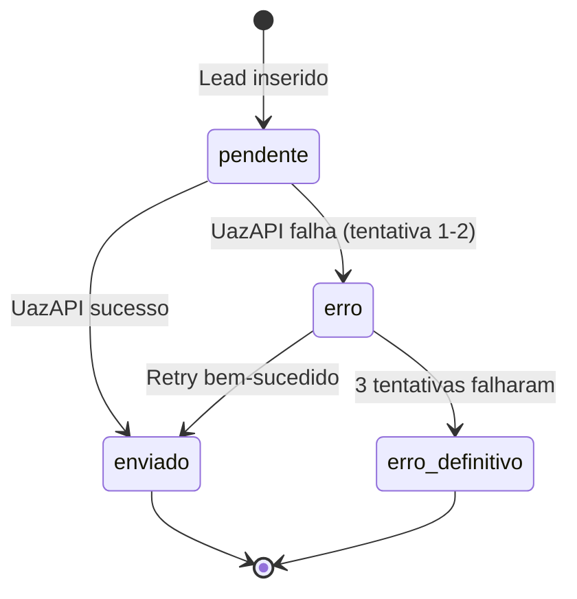
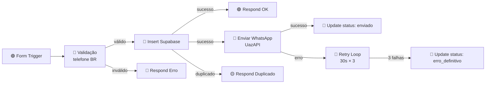

# CazorlaHub Lead Capture — Fullstack Architecture Document

## Change Log

| Date | Version | Description | Author |
|------|---------|-------------|--------|
| 2026-04-05 | 1.0 | Arquitetura inicial — MVP n8n + Supabase + UazAPI | Aria (@architect) |

---

## 1. Introduction

Este documento define a arquitetura completa do sistema de captura de leads do CazorlaHub. A Fase 1 é um MVP no-code/low-code baseado em n8n + Supabase + UazAPI, desacoplado do site oficial `cazorlahub.com.br`. A Fase 2 migrará o fluxo validado para o site oficial.

**Starter Template:** N/A — ambiente n8n isolado para Fase 1 MVP.

---

## 2. High-Level Architecture

### Technical Summary

Sistema de captura de leads baseado em automação no-code. O n8n fornece o formulário público, processa o fluxo de dados e orquestra as integrações. O Supabase atua como banco de dados gerenciado (PostgreSQL) com dashboard nativo. A UazAPI conecta um número WhatsApp para envio de mensagens personalizadas. A arquitetura é intencionalmente simples para validação rápida, com separação clara entre camadas para facilitar migração futura.

### Platform & Infrastructure

- **Fase 1:** n8n (Cloud ou Self-hosted — a decidir) + Supabase Cloud + UazAPI
- **Hospedagem n8n:** A decidir (n8n Cloud recomendado para MVP)
- **Banco de Dados:** Supabase Cloud (free tier)
- **WhatsApp:** UazAPI (instância dedicada)

### Architecture Diagram



### Architectural Patterns

- **No-code Orchestration:** n8n como motor central — formulário, lógica e integrações num único lugar
- **Event-Driven:** cada submissão de formulário dispara o workflow assincronamente
- **Soft Delete:** campo `deleted_at` para conformidade LGPD sem perda de dados
- **Retry Pattern:** até 3 tentativas com backoff de 30s para envio WhatsApp
- **Status Machine:** `status_whatsapp` segue máquina de estados bem definida

---

## 3. Tech Stack

| Categoria | Tecnologia | Versão | Propósito | Rationale |
|-----------|-----------|--------|-----------|-----------|
| Automação/Orquestração | n8n | Latest | Formulário + workflow + integrações | No-code, rápido para MVP |
| Banco de Dados | Supabase (PostgreSQL) | Latest | Persistência de leads + dashboard | Grátis, RLS nativo, export CSV |
| WhatsApp API | UazAPI | Latest | Envio de mensagens personalizadas | Escolha do cliente |
| Hospedagem n8n | A decidir | — | n8n Cloud ou Self-hosted | Pós-validação MVP |
| HTTP Client | n8n HTTP Request Node | Nativo | Chamadas REST Supabase e UazAPI | Built-in n8n |
| Autenticação Admin | Supabase Dashboard | Nativo | Acesso ao painel de leads | Zero configuração |
| CI/CD | GitHub Actions | — | Documentação e configs versionadas | Já configurado |

---

## 4. Data Models

### Lead

**Purpose:** Representa um potencial cliente capturado pelo formulário.

| Campo | Tipo | Obrigatório | Descrição |
|-------|------|-------------|-----------|
| `id` | UUID | Sim | Identificador único (auto-gerado) |
| `nome` | text | Sim | Nome completo do lead |
| `telefone` | text | Sim | Telefone BR `(99) 99999-9999` |
| `email` | text | Não | Email do lead (opcional) |
| `status_whatsapp` | text | Sim | Estado do envio WhatsApp |
| `tentativas_envio` | integer | Sim | Contador de tentativas (max: 3) |
| `origem` | text | Não | Fonte (default: `n8n-formulario`) |
| `created_at` | timestamptz | Sim | Data/hora de criação (auto) |
| `deleted_at` | timestamptz | Não | Soft-delete LGPD |

**SQL Supabase:**

```sql
CREATE TABLE leads (
  id UUID DEFAULT gen_random_uuid() PRIMARY KEY,
  nome TEXT NOT NULL,
  telefone TEXT NOT NULL,
  email TEXT,
  status_whatsapp TEXT NOT NULL DEFAULT 'pendente',
  tentativas_envio INTEGER NOT NULL DEFAULT 0,
  origem TEXT DEFAULT 'n8n-formulario',
  created_at TIMESTAMPTZ DEFAULT NOW(),
  deleted_at TIMESTAMPTZ
);

CREATE UNIQUE INDEX idx_leads_telefone_ativo
  ON leads(telefone)
  WHERE deleted_at IS NULL;

ALTER TABLE leads ENABLE ROW LEVEL SECURITY;
```

**Status WhatsApp — Máquina de Estados:**



---

## 5. API Specification

### 5.1 Supabase REST API (via n8n)

```
POST {SUPABASE_URL}/rest/v1/leads
Headers:
  apikey: {SUPABASE_ANON_KEY}
  Authorization: Bearer {SUPABASE_ANON_KEY}
  Content-Type: application/json
  Prefer: return=representation

Body:
{
  "nome": "João Silva",
  "telefone": "(11) 99999-9999",
  "email": "joao@email.com"
}

Response 201:
{
  "id": "uuid",
  "nome": "João Silva",
  "telefone": "(11) 99999-9999",
  "status_whatsapp": "pendente",
  "created_at": "2026-04-05T..."
}
```

```
PATCH {SUPABASE_URL}/rest/v1/leads?id=eq.{id}
Headers: (same as above)
Body: { "status_whatsapp": "enviado", "tentativas_envio": 1 }
```

### 5.2 UazAPI (via n8n)

```
POST {UAZAPI_BASE_URL}/message/sendText/{INSTANCE_NAME}
Headers:
  Authorization: Bearer {UAZAPI_TOKEN}
  Content-Type: application/json

Body:
{
  "number": "5511999999999",
  "text": "Olá, João! Recebemos seu contato e em breve nossa equipe entrará em contato. 😊"
}
```

### Variáveis de Ambiente n8n

| Variável | Descrição |
|----------|-----------|
| `SUPABASE_URL` | URL do projeto Supabase |
| `SUPABASE_ANON_KEY` | Chave anônima Supabase |
| `UAZAPI_BASE_URL` | URL base UazAPI |
| `UAZAPI_TOKEN` | Token de autenticação UazAPI |
| `UAZAPI_INSTANCE` | Nome da instância WhatsApp |

---

## 6. Components — Workflow n8n



| Node | Tipo | Função |
|------|------|--------|
| Form Trigger | Trigger | Exibe formulário e recebe dados |
| Code (validação) | Transform | Valida telefone BR com regex |
| HTTP Request — Supabase INSERT | Action | Insere lead no banco |
| HTTP Request — Supabase PATCH | Action | Atualiza status_whatsapp |
| HTTP Request — UazAPI | Action | Envia WhatsApp personalizado |
| Respond to Webhook | Output | Confirmação ao usuário |
| Wait | Control | Pausa 30s entre retries |
| IF | Control | Controle de branches |

**Regex validação telefone BR:**
```javascript
// No node Code do n8n
const telefone = $input.first().json.telefone;
const regex = /^\(\d{2}\)\s9\d{4}-\d{4}$/;
if (!regex.test(telefone)) {
  throw new Error('Telefone inválido. Use o formato (99) 99999-9999');
}
return $input.all();
```

---

## 7. Riscos & Decisões

| Risco | Impacto | Mitigação |
|-------|---------|-----------|
| UazAPI instância desconectada | Alto | Monitorar conexão; retry automático |
| Rate limit UazAPI | Médio | Fila sequencial, não paralela |
| Supabase free tier (500MB) | Baixo | MVP tem poucos leads; monitorar |
| n8n fora do ar | Alto | Usar n8n Cloud para MVP |
| Telefone duplicado | Médio | Index único + tratamento no workflow |
| LGPD | Médio | Soft-delete + policy de retenção |

---

## 8. Plano de Migração — Fase 2

A migração ocorre somente após validação completa do MVP.

1. Investigar tech stack do `cazorlahub.com.br`
2. `@architect *create-brownfield-architecture` — plano de integração
3. Substituir formulário n8n por formulário nativo do site
4. Manter Supabase + UazAPI (reutilizar backend 100%)
5. Webhook do site substitui o Form Trigger do n8n

---

## 9. Next Steps

### Para @data-engineer (Dara)
Implementar o schema SQL detalhado no Supabase: criar tabela `leads`, indexes, RLS policies e validar exportação CSV.

### Para @sm (River)
Com PRD e arquitetura aprovados, criar stories detalhadas do Epic 1 (Story 1.1 e 1.2) seguindo o template AIOX.

### Para @dev (Dex)
Implementar o workflow n8n seguindo os nodes e fluxo definidos neste documento.
